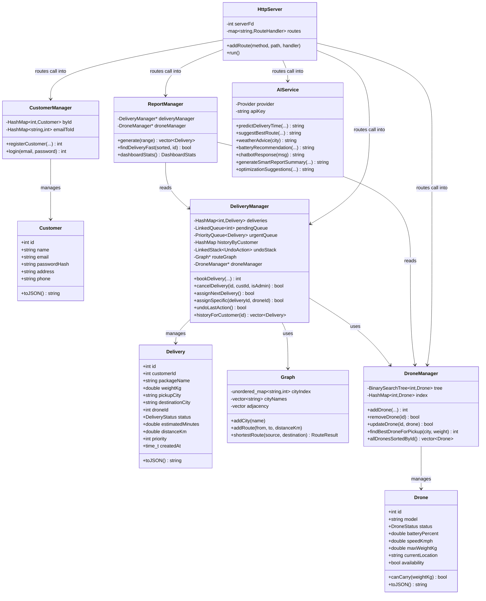

# Class Diagram

```mermaid
classDiagram
    class Drone {
        +int id
        +string model
        +DroneStatus status
        +double batteryPercent
        +double speedKmph
        +double maxWeightKg
        +string currentLocation
        +bool availability
        +canCarry(weightKg) bool
        +toJSON() string
    }

    class Customer {
        +int id
        +string name
        +string email
        +string passwordHash
        +string address
        +string phone
        +toJSON() string
    }

    class Delivery {
        +int id
        +int customerId
        +string packageName
        +double weightKg
        +string pickupCity
        +string destinationCity
        +int droneId
        +DeliveryStatus status
        +double estimatedMinutes
        +double distanceKm
        +int priority
        +time_t createdAt
        +toJSON() string
    }

    class Graph {
        -unordered_map~string,int~ cityIndex
        -vector~string~ cityNames
        -vector adjacency
        +addCity(name)
        +addRoute(from, to, distanceKm)
        +shortestRoute(source, destination) RouteResult
    }

    class DroneManager {
        -BinarySearchTree~int,Drone~ tree
        -HashMap~int,Drone~ index
        +addDrone(...) int
        +removeDrone(id) bool
        +updateDrone(id, drone) bool
        +findBestDroneForPickup(city, weight) int
        +allDronesSortedById() vector~Drone~
    }

    class CustomerManager {
        -HashMap~int,Customer~ byId
        -HashMap~string,int~ emailToId
        +registerCustomer(...) int
        +login(email, password) int
    }

    class DeliveryManager {
        -HashMap~int,Delivery~ deliveries
        -LinkedQueue~int~ pendingQueue
        -PriorityQueue~Delivery~ urgentQueue
        -HashMap historyByCustomer
        -LinkedStack~UndoAction~ undoStack
        -Graph* routeGraph
        -DroneManager* droneManager
        +bookDelivery(...) int
        +cancelDelivery(id, custId, isAdmin) bool
        +assignNextDelivery() bool
        +assignSpecific(deliveryId, droneId) bool
        +undoLastAction() bool
        +historyForCustomer(id) vector~Delivery~
    }

    class ReportManager {
        -DeliveryManager* deliveryManager
        -DroneManager* droneManager
        +generate(range) vector~Delivery~
        +findDeliveryFast(sorted, id) bool
        +dashboardStats() DashboardStats
    }

    class AIService {
        -Provider provider
        -string apiKey
        +predictDeliveryTime(...) string
        +suggestBestRoute(...) string
        +weatherAdvice(city) string
        +batteryRecommendation(...) string
        +chatbotResponse(msg) string
        +generateSmartReportSummary(...) string
        +optimizationSuggestions(...) string
    }

    class HttpServer {
        -int serverFd
        -map~string,RouteHandler~ routes
        +addRoute(method, path, handler)
        +run()
    }

    DeliveryManager --> Graph : uses
    DeliveryManager --> DroneManager : uses
    ReportManager --> DeliveryManager : reads
    ReportManager --> DroneManager : reads
    HttpServer --> DeliveryManager : routes call into
    HttpServer --> DroneManager : routes call into
    HttpServer --> CustomerManager : routes call into
    HttpServer --> ReportManager : routes call into
    HttpServer --> AIService : routes call into
    DroneManager --> Drone : manages
    CustomerManager --> Customer : manages
    DeliveryManager --> Delivery : manages
```
