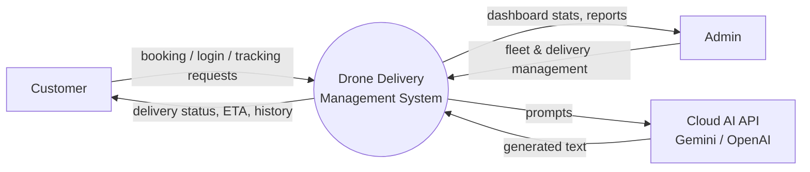
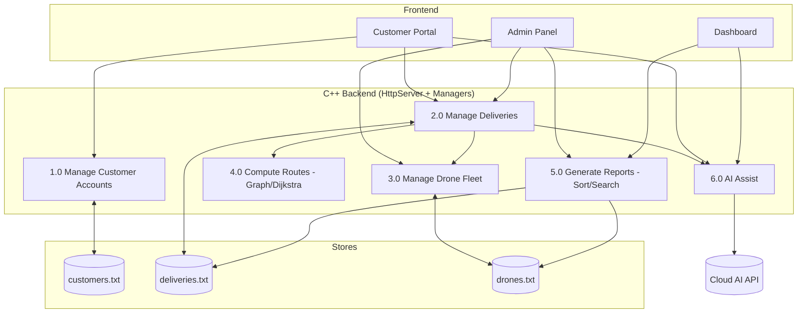

# Data Flow Diagram (Level 0 & Level 1)

## Level 0 — Context Diagram

```mermaid
flowchart LR
    Cust[Customer] -- booking / login / tracking requests --> Sys((Drone Delivery<br/>Management System))
    Sys -- delivery status, ETA, history --> Cust
    Adm[Admin] -- fleet & delivery management --> Sys
    Sys -- dashboard stats, reports --> Adm
    Sys -- prompts --> AI[Cloud AI API<br/>Gemini / OpenAI]
    AI -- generated text --> Sys
```

## Level 1 — Process Breakdown

```mermaid
flowchart TD
    subgraph Frontend
        F1[Customer Portal]
        F2[Admin Panel]
        F3[Dashboard]
    end

    subgraph Backend ["C++ Backend (HttpServer + Managers)"]
        P1[1.0 Manage Customer Accounts]
        P2[2.0 Manage Deliveries]
        P3[3.0 Manage Drone Fleet]
        P4[4.0 Compute Routes - Graph/Dijkstra]
        P5[5.0 Generate Reports - Sort/Search]
        P6[6.0 AI Assist]
    end

    subgraph Stores
        D1[(customers.txt)]
        D2[(deliveries.txt)]
        D3[(drones.txt)]
    end

    F1 --> P1
    F1 --> P2
    F2 --> P3
    F2 --> P2
    F2 --> P5
    F3 --> P5

    P1 <--> D1
    P2 <--> D2
    P3 <--> D3
    P2 --> P4
    P2 --> P3
    P5 --> D2
    P5 --> D3
    P2 --> P6
    F1 --> P6
    F3 --> P6
    P6 --> AI[(Cloud AI API)]
```
