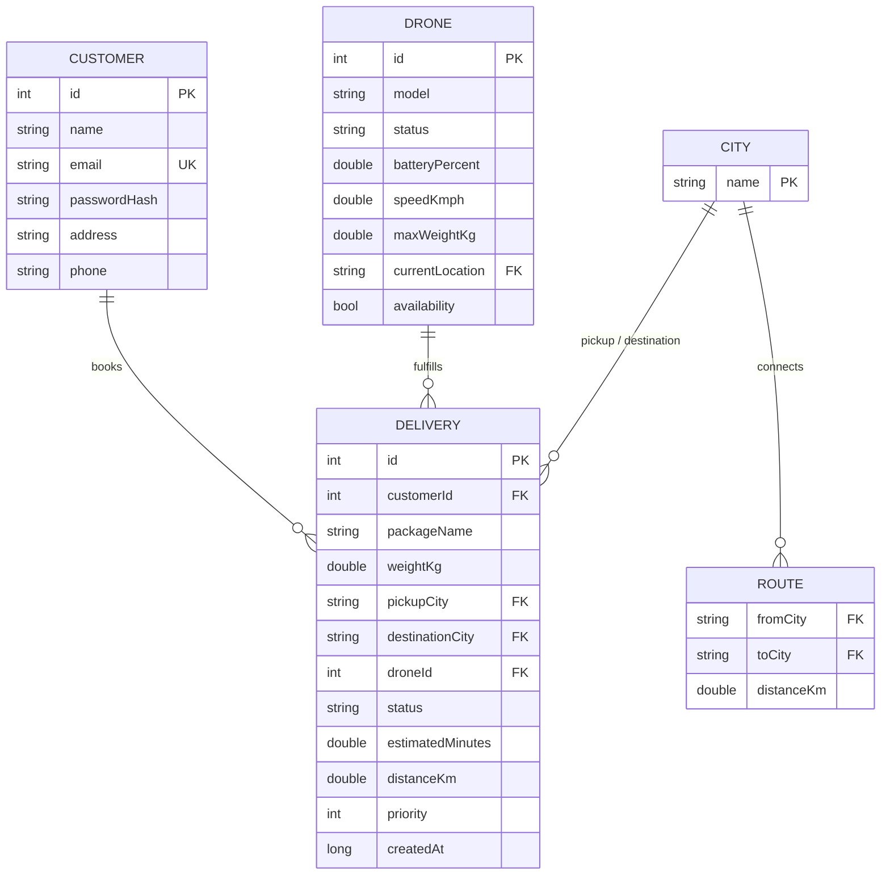

# ER Diagram

Rendered with [Mermaid](https://mermaid.js.org/) — view on GitHub, VS Code
(Mermaid preview extension), or https://mermaid.live by pasting the block
below.

## Notes
- `CITY` and `ROUTE` model the in-memory `Graph` (adjacency list); they are
  not persisted as a separate flat file in this build, but are shown here
  because they are first-class entities in the domain model.
- `DELIVERY.droneId` is nullable-equivalent (`-1`) until a drone is assigned.
