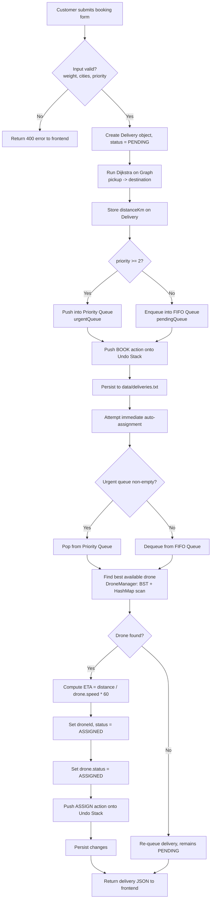
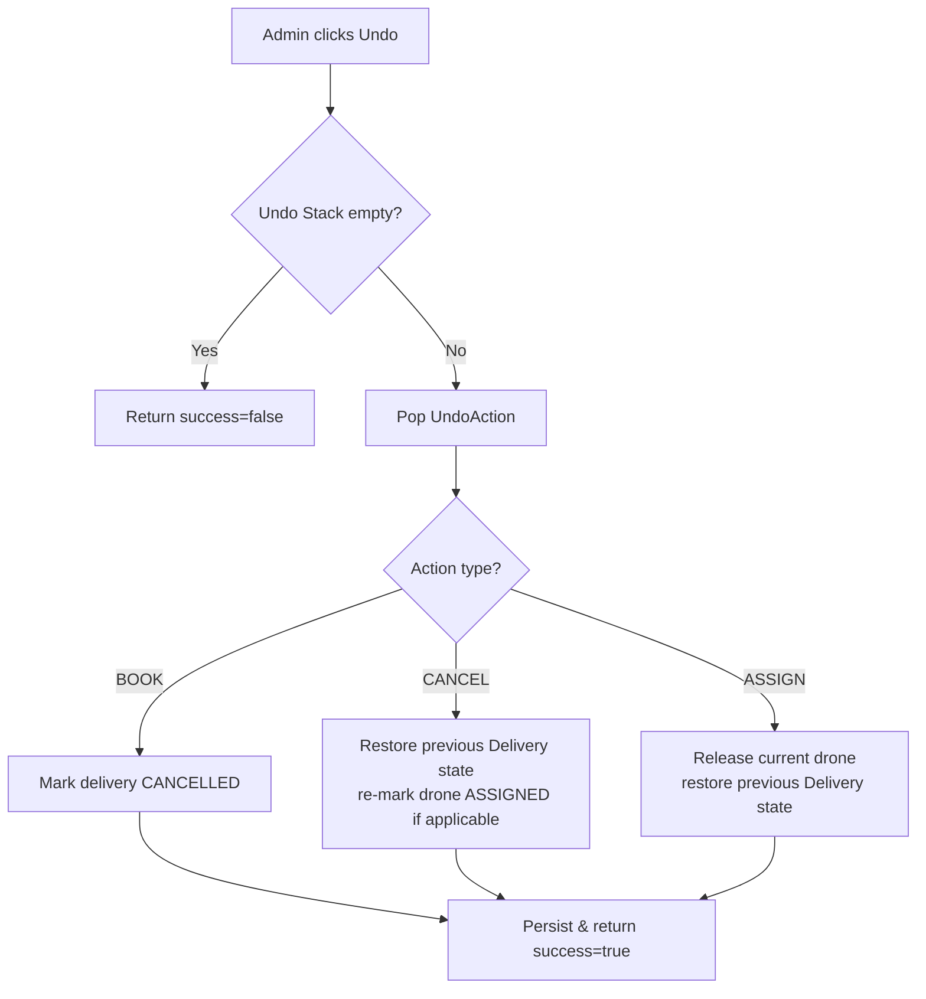

# Flowchart — Delivery Booking & Assignment

```mermaid
flowchart TD
    A[Customer submits booking form] --> B{Input valid?<br/>weight, cities, priority}
    B -- No --> Z1[Return 400 error to frontend]
    B -- Yes --> C[Create Delivery object, status = PENDING]
    C --> D[Run Dijkstra on Graph<br/>pickup -> destination]
    D --> E[Store distanceKm on Delivery]
    E --> F{priority >= 2?}
    F -- Yes --> G[Push into Priority Queue<br/>urgentQueue]
    F -- No --> H[Enqueue into FIFO Queue<br/>pendingQueue]
    G --> I[Push BOOK action onto Undo Stack]
    H --> I
    I --> J[Persist to data/deliveries.txt]
    J --> K[Attempt immediate auto-assignment]

    K --> L{Urgent queue non-empty?}
    L -- Yes --> M[Pop from Priority Queue]
    L -- No --> N[Dequeue from FIFO Queue]
    M --> O
    N --> O[Find best available drone<br/>DroneManager: BST + HashMap scan]
    O --> P{Drone found?}
    P -- No --> Q[Re-queue delivery, remains PENDING]
    P -- Yes --> R[Compute ETA = distance / drone.speed * 60]
    R --> S[Set droneId, status = ASSIGNED]
    S --> T[Set drone.status = ASSIGNED]
    T --> U[Push ASSIGN action onto Undo Stack]
    U --> V[Persist changes]
    V --> W[Return delivery JSON to frontend]
    Q --> W
```

# Flowchart — Admin Undo

```mermaid
flowchart TD
    A[Admin clicks Undo] --> B{Undo Stack empty?}
    B -- Yes --> C[Return success=false]
    B -- No --> D[Pop UndoAction]
    D --> E{Action type?}
    E -- BOOK --> F[Mark delivery CANCELLED]
    E -- CANCEL --> G[Restore previous Delivery state<br/>re-mark drone ASSIGNED if applicable]
    E -- ASSIGN --> H[Release current drone<br/>restore previous Delivery state]
    F --> I[Persist & return success=true]
    G --> I
    H --> I
```
