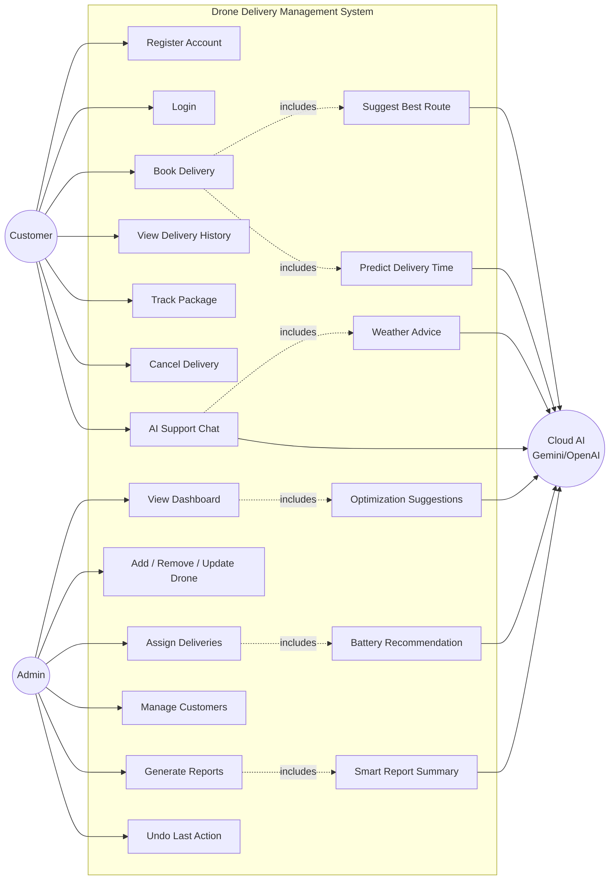

# Use Case Diagram

All Cloud-AI use cases degrade to an offline, rule-based fallback computed
from the same C++ DSA-derived data when no `GEMINI_API_KEY` /
`OPENAI_API_KEY` is configured, so the system never depends on AI
availability for correctness.
